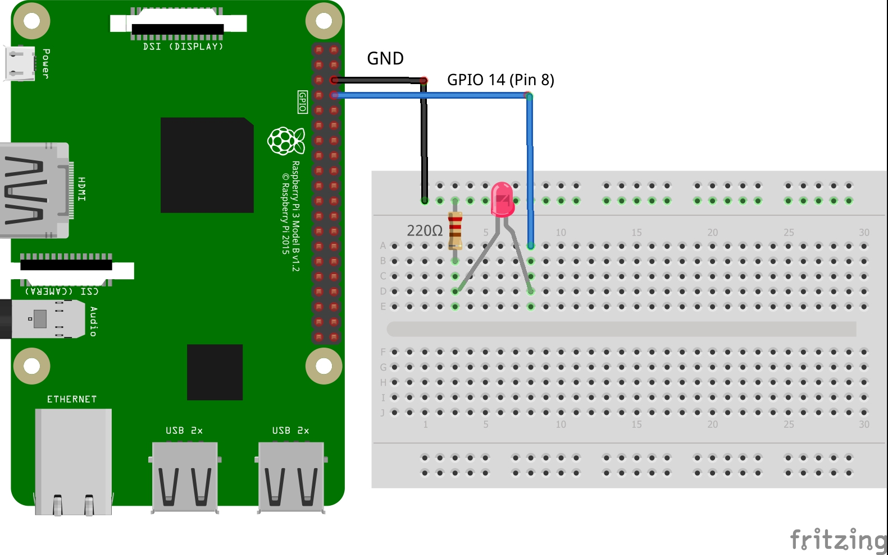

# Raspberry-Pi-WhatsApp 
<h3>Instalación yowsup</h3>

<pre>
<code>
$ git clone https://github.com/tgalal/yowsup
$ cd yowsup
$ sudo python setup.py install
</code>
</pre>
<h3>Registro</h3>
<pre>
<code>
$  yowsup-cli registration --requestcode sms --phone 49XXXXXXXX --cc 49 --mcc 123 --mnc 456
$  yowsup-cli registration --register 123456 --phone 49XXXXXXXX --cc 49  
</code>
mcc y mnc, los puede consultar <a href="https://en.wikipedia.org/wiki/Mobile_country_code" target="_blank">Aquí</a>

* Donde 123456, es el còdigo que llega  al celular en un mensaje de texto
</pre>

<h3>Clonar el repositorio</h3>
<pre>
<code>
$  git clone https://github.com/rpi-jefer/Raspberry-Pi-WhatsApp
$  cd Raspberry-Pi-WhatsApp
</code>
Modificar:

En <em>run.py</em>
<code>CREDENTIALS = ("phone", "password") #replace with your phone and password</code>

Luego ejecutar
<code><b>$ sudo python run.py</b></code>
</pre>

<h3>Plano</h3>

  

<h3></h3>

